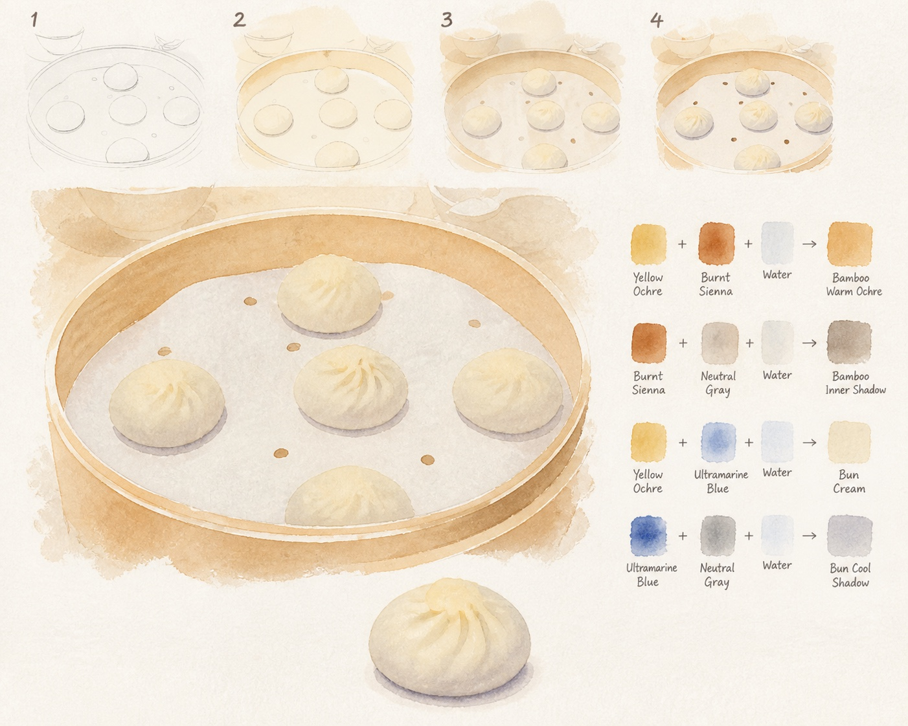
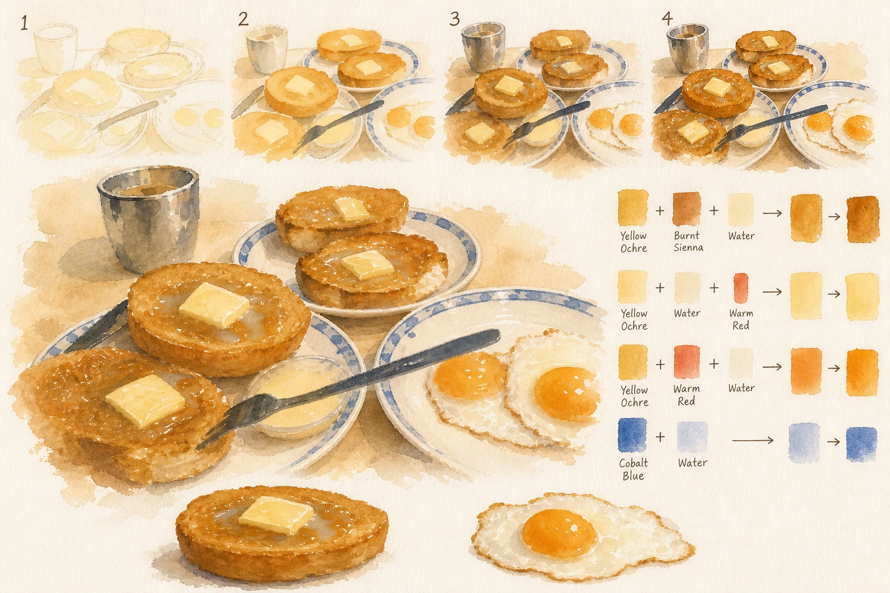
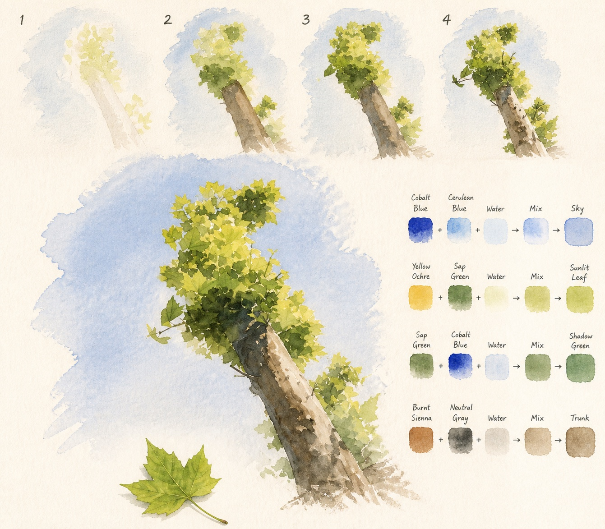
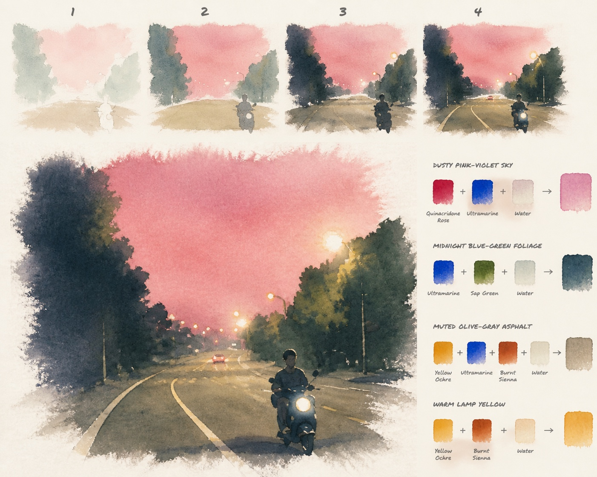
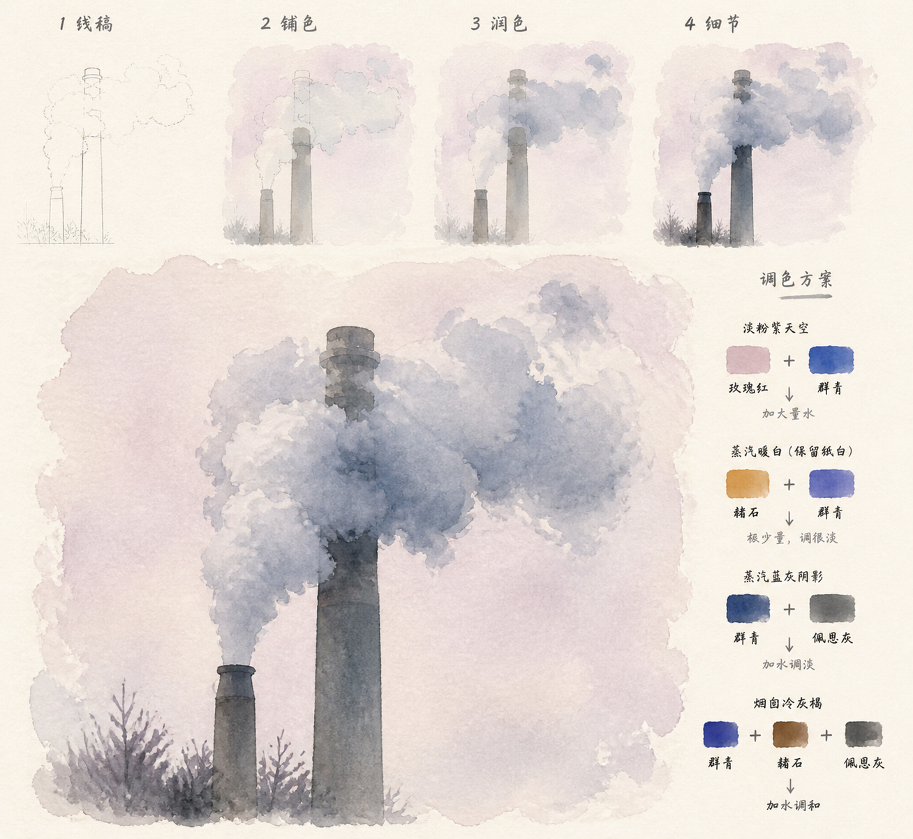
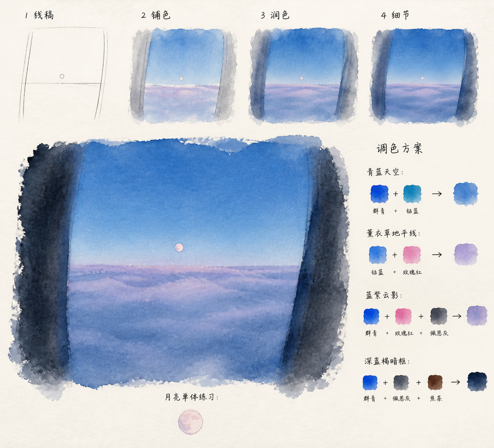
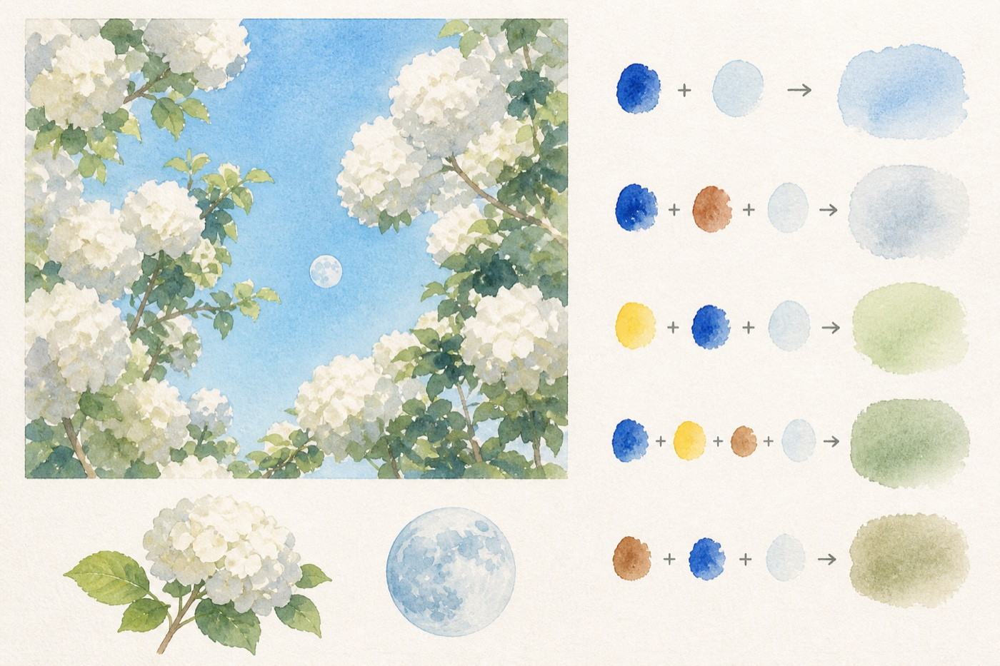
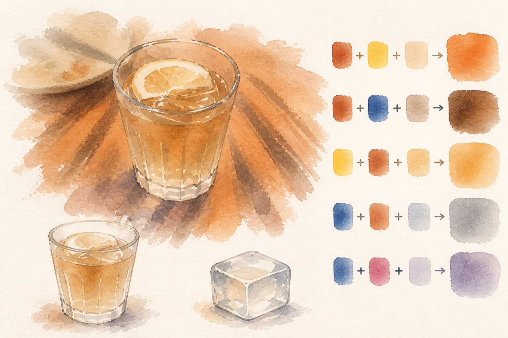

# Watercolor Deconstruction Board

把照片或插画转换成适合零基础临摹的水彩教学板：用同一构图依次展示线稿、铺色、润色和极少细节，再给出简化后的完整水彩、可独立练习的完整对象，以及基础颜料到画面颜色的混色过程。

## 效果展示

### 最新案例 · 从线稿到极少细节

<table>
  <tr>
    <th>包子蒸笼 · 线稿、铺色、润色、细节</th>
    <th>港式早餐 · 食物大色块与完整对象</th>
  </tr>
  <tr>
    <td></td>
    <td></td>
  </tr>
  <tr>
    <th>梧桐树 · 合并叶片与清透天空</th>
    <th>粉色夜路 · 深色树墙与灯光节奏</th>
  </tr>
  <tr>
    <td></td>
    <td></td>
  </tr>
  <tr>
    <th>工业烟囱 · 合并蒸汽云团</th>
    <th>月亮云海 · 蓝色渐层与软边暗框</th>
  </tr>
  <tr>
    <td></td>
    <td></td>
  </tr>
</table>

### 更多案例

<table>
  <tr>
    <th>峡谷公路 · 地貌与空间</th>
    <th>花月 · 清透植物水色</th>
  </tr>
  <tr>
    <td></td>
    <td></td>
  </tr>
</table>

### 玻璃杯 · 写生本中等细节与自然散边

<p align="center">
  
</p>

案例用于展示不同参考图下的布局与抽象方式。生成结果会根据主体完整性、场景层级和可绘制性自动调整，并不强制填满每个区域。完成图默认停在“已经能认出来，但还没有开始抠表面纹理”的程度。

## 主要能力

- 用同一构图展示线稿、铺色、润色和极少细节四个累加阶段
- 先用 6–9 个连续大色面建立画面，完成图保持约 75%–80% 的大色面
- 将结构提示控制在约 10–16 笔，删除颗粒、孔洞、碎叶和重复表面纹理
- 保留轮廓、空间关系与最多四个关键识别点
- 使用清透、低至中等饱和度的水洗，让纸白参与画面发光
- 让主画通过断笔、浅洗和留白自然散入纸面，避免方正照片边框
- 将人物转成易画、轻卡通化的编辑水彩风格
- 只拆分完整、可命名的场景元素，避免孤立树杈或任意碎片
- 自动降低背景建筑的窗格、栏杆和重复构件，避免抢夺主体
- 使用 3–5 种基础颜料构建画面主色的可视化混色方案
- 自动控制重复纹理、建筑构件、植被和岩石细节

## 安装

在 Codex 中调用 `$skill-installer`，并让它从本仓库安装：

```text
使用 $skill-installer 从以下仓库安装 watercolor-deconstruction-board：
https://github.com/PartinGQAQ/watercolor-deconstruction-board/tree/main/watercolor-deconstruction-board
```

也可以把 `watercolor-deconstruction-board/` 文件夹复制到个人 Skill 目录：

```text
$HOME/.agents/skills/watercolor-deconstruction-board/
```

如果安装后没有立即出现，请重启 Codex。

## 使用

上传一张参考图片，然后输入：

```text
使用 $watercolor-deconstruction-board 转换这张图片。
```

也可以进一步指定偏好：

```text
使用 $watercolor-deconstruction-board 转换这张照片。
人物再卡通一点，色块稍大，底部只拆出完整且能单独成画的对象。
```

## 输出结构

生成结果通常包含：

1. 同一构图的线稿、铺色、润色和极少细节四步流程
2. 简化后的完整水彩主画
3. 0–3 个完整、独立的场景元素习作
4. 4–6 组从基础颜料到画面目标色的混色过程

具体数量会根据参考图片自然调整，不会为了填满版面强行拆分残缺对象。

## 文件结构

```text
watercolor-deconstruction-board/
├── README.md
├── LICENSE
├── docs/images/
└── watercolor-deconstruction-board/
    ├── SKILL.md
    └── agents/openai.yaml
```

## 运行要求

该 Skill 需要宿主环境提供图片输入与图片生成/编辑能力。生成结果会受所用图像模型及参考图内容影响。

## License

[MIT](LICENSE)
