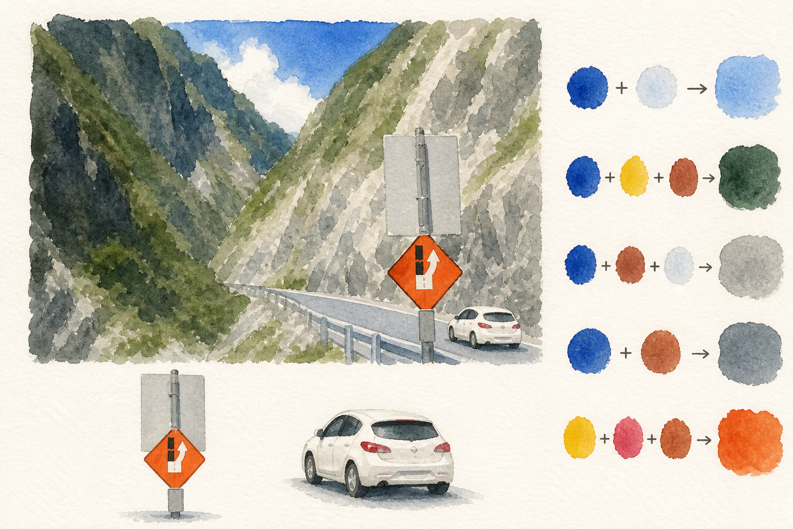

# Watercolor Deconstruction Board

把照片或插画转换成适合初学者临摹的水彩拆解学习板：用大色块概括完整场景，拆出少量完整、可独立绘制的场景元素，并展示基础颜料到画面颜色的混色过程。

## 效果展示

<p align="center">
  
</p>

## 主要能力

- 将复杂照片归并为 4–7 个连续大色块
- 保留轮廓、空间关系与最多四个关键识别点
- 将人物转成易画、轻卡通化的编辑水彩风格
- 只拆分完整、可命名的场景元素，避免孤立树杈或任意碎片
- 使用 3–5 种基础颜料构建画面主色的可视化混色方案
- 自动控制重复纹理、建筑构件、植被和岩石细节

## 安装

在 Codex 中调用 `$skill-installer`，并让它从本仓库安装：

```text
使用 $skill-installer 从以下仓库安装 watercolor-deconstruction-board：
https://github.com/PartinGQAQ/watercolor-deconstruction-board
```

也可以把 `watercolor-deconstruction-board/` 文件夹复制到个人 Skill 目录：

```text
$HOME/.agents/skills/watercolor-deconstruction-board/
```

如果安装后没有立即出现，请重启 Codex。

## 使用

上传一张参考图片，然后输入：

```text
使用 $watercolor-deconstruction-board 转换这张图片。
```

也可以进一步指定偏好：

```text
使用 $watercolor-deconstruction-board 转换这张照片。
人物再卡通一点，色块稍大，底部只拆出完整且能单独成画的对象。
```

## 输出结构

生成结果通常包含：

1. 简化后的完整水彩主画
2. 0–3 个完整、独立的场景元素习作
3. 4–6 组从基础颜料到画面目标色的混色过程

具体数量会根据参考图片自然调整，不会为了填满版面强行拆分残缺对象。

## 文件结构

```text
watercolor-deconstruction-board/
├── README.md
├── LICENSE
├── docs/images/
└── watercolor-deconstruction-board/
    ├── SKILL.md
    └── agents/openai.yaml
```

## 运行要求

该 Skill 需要宿主环境提供图片输入与图片生成/编辑能力。生成结果会受所用图像模型及参考图内容影响。

## License

[MIT](LICENSE)
